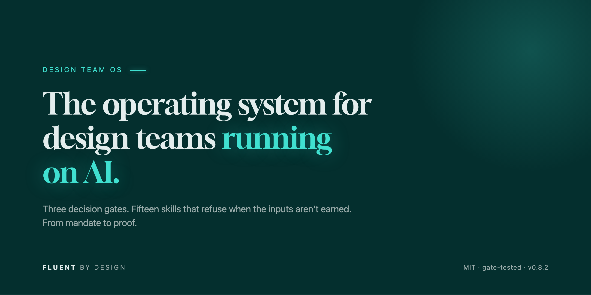
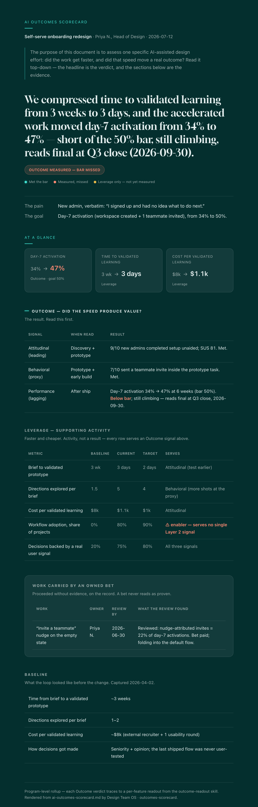
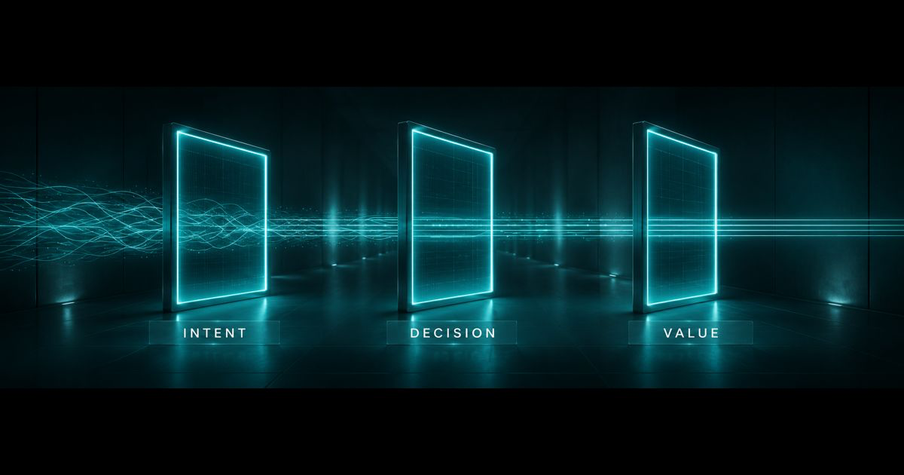

<!-- HERO: generated instrument art in the Fluent by Design system.
     A single dark teal banner reads well on both GitHub themes, so no <picture> swap needed. -->
<p align="center">
  <a href="https://fluentxdesign.com/?utm_source=github&utm_medium=readme">
    
  </a>
</p>

<h3 align="center">The operating system for design teams running on AI.</h3>
<p align="center"><em>Open source. Gate-tested. From mandate to proof — the honest floor over the hopeful ceiling.</em></p>

<p align="center">
  <a href="LICENSE"></a>
  <a href="CHANGELOG.md"></a>
  
  <a href=".github/workflows/gates.yml"></a>
  <a href="https://fluentxdesign.substack.com"></a>
</p>

<p align="center">
  <a href="https://baseline.fluentxdesign.com/?utm_source=github&utm_medium=readme"><b>Run the baseline</b></a> ·
  <a href="https://fluentxdesign.com/?utm_source=github&utm_medium=readme"><b>fluentxdesign.com</b></a> ·
  <a href="https://fluentxdesign.substack.com"><b>Newsletter</b></a> ·
  <a href="IMPLEMENTATION.md"><b>Docs</b></a> ·
  <a href="EXAMPLES.md"><b>See it work</b></a>
</p>

---

Most AI skill libraries are built for a single designer trying to move faster. This is an operating system for the whole team: three gates that keep speed intentional, skills that enforce them and refuse when the inputs aren't earned, a ledger that carries the evidence from pain to shipped outcome, and a conductor that always knows what can run next. It connects a company's AI mandate to what its design team actually ships, so every fast, cheap prototype stays tied to something that matters.

## What it is

A set of Claude skills that takes a design team from raw research to a shipped, measured outcome in days instead of weeks. Each skill is a small, focused unit of judgment you can drop into Claude Code or a Claude Project. MIT licensed. It grows by release: each version either extends the machine — a new gate skill, the work ledger, the `conductor` — or sharpens a capability it already has ([CHANGELOG.md](CHANGELOG.md) has the history).

<p align="center">
  
  <br>
  <em>What it produces: the <a href="templates/ai-outcomes-scorecard.md">AI Outcomes Scorecard</a> — the one page a Head of Design carries upward, refusing to let activity read as a result.</em>
</p>

## Who this is for

Heads of Design, VPs of Design, and Design Directors at product led companies, usually 50 to 500 people, running a team of 5 to 20 designers.

You have the AI tools. Your team is experimenting in private. Quality is all over the place, engineering is racing ahead, and you do not yet have a shared way of working that turns all that motion into proof. That gap is what this library closes.

And if you're the designer on that team, not the one leading it: the skills work for you alone, in a browser, today — copy one file into a Claude Project and go ([60-second path](PROJECTS.md)). The system is built for the team; every piece of it is useful solo.

Want to see it work before reading another word? [EXAMPLES.md](EXAMPLES.md) walks one feature through the whole loop — including the moments the skills refuse, which is the point.

## The spine

The skills are not random utilities. They map to three decision gates. The gates are the point. They are what keep speed intentional once anyone can generate a prototype in an afternoon.

<p align="center">
  
  <br>
  <em>Raw activity enters on the left and leaves as refined proof — through three gates every piece of work must pass.</em>
</p>

**Gate 1, Intent.** Does this map to a business goal and a real customer pain? Governs which work is worth starting.

**Gate 2, Decision.** What do we prototype, and what does good look like? Governs what gets built and what the quality bar is. This is where design judgment lives, and it is the part AI cannot do for you.

**Gate 3, Value.** Did it solve the pain and move the needle? Governs the proof that the work mattered, and the loop back to strategy.

Speed without these gates is fifty prototypes and no way to choose. Speed with them is a team that learns faster and can show the learning paid off.

## The machine

The gates take judgment; the routing between them never should have. Two pieces carry the routing so nobody has to hold the sequence in their head — and neither ever makes a judgment call:

**The work ledger** (`design-os.work/<slug>.yaml`, schema in [templates/work-ledger.schema.md](templates/work-ledger.schema.md)) is one file per piece of work that carries its state across sessions, people, and weeks: which gates are proven, with the evidence itself embedded. Its one rule: **artifacts, never checkmarks.** There is no `done: true` in the schema, deliberately — an entry is the evidence, the pre-registered bar, the quoted validation signal, or the gate is open. Skills write their own artifacts; humans see the work's state change as a diff in a PR.

**The conductor** (`skills/conductor/`) reads that state — or, with no ledger, whatever artifacts you describe — and reports which gates are proven, which are open, and what can run right now. Resume after two weeks out, hand work to a teammate, or walk in mid-stream with a PM's prototype that never saw Gate 1: ask "where are we?" and it answers with the state set and the runnable moves, several at once when several apply. **It routes; it never judges.** It will not certify a gate, and it refuses to carry a checkmark forward — a `validated: true` with no evidence behind it reads as an open gate, and it says so.

And because real organizations sometimes proceed without evidence on purpose — a contract commitment, a compliance deadline, a strategic call — a gate can carry an **owned bet** instead of its artifact: a named owner, a declared acknowledgment that the evidence is absent, the reason, and a review date that will judge the bet ([schema](templates/work-ledger.schema.md)). A bet never reads as proven and never excuses the bar; it makes the exception loud and owned instead of silent. What separates a bet from a laundered gate: laundering claims the evidence exists, a bet declares it absent and signs for it.

None of this is required. Every skill still gates its own inputs and works alone in a chat with nothing else installed; the machine is what makes the loop resumable and shared. Work is a state set, not an assembly line — cycles are normal, parallel work items are normal, and entering anywhere is normal, because the gates themselves route wrong-order entry back to what's missing.

## Skills

Fifteen skills are live under `skills/` — every skill's primary refusal is encoded as a runnable fixture, with adversarial coverage growing release by release ([TESTING.md](TESTING.md)): the original eight (v0.1, June 12, 2026), three loop-closing skills (v0.2) that wire the gates into a full Intent → Decision → Value → Intent loop, the most upstream skill in the library (v0.3) that produces the validated pain everything else assumes, `team-ai-baseline` (v0.4), which sits above the gates and tells a team whether it is actually running them, the `conductor` (v0.5), the machine's routing layer, and `outcomes-scorecard` (v0.8), which renders the program-level scorecard into a shareable page and refuses to let activity read as a result.

| Skill | Gate | What it does | Status |
| --- | --- | --- | --- |
| conductor | Routing | Reads a work ledger and reports which gates are proven, which are open, and what can run now | v0.5 |
| outcomes-scorecard | Value | Renders the program-level scorecard into a shareable page and refuses to let activity read as a result | v0.8 |
| team-ai-baseline | All gates | Places a team honestly on the AI maturity curve and names the one gate holding it back | v0.4 |
| research-to-pain | Intent | Turns raw research into a small set of ranked, evidence-backed customer pains | v0.3 |
| brief-from-pain | Intent → Decision | Turns a validated pain into a brief with a measurable bar set up front | v0.2 |
| prototype-triage | Decision | Triages a generated prototype against the brief before human review | v0.2 |
| outcome-readout | Value | Reads shipped analytics against the bar and names the next problem | v0.2 |
| prd-to-ia | Intent | Turns a PRD into a first pass information architecture | v0.1 |
| design-system-enforcement | Decision | Holds generated UI to your design system | v0.1 |
| critique-synthesis | Decision | Synthesizes scattered critique into clear direction | v0.1 |
| user-journey-mapping | Intent | Drafts a journey map from a brief and known signals | v0.1 |
| prototype-to-spec | Value | Turns a chosen prototype into a buildable spec | v0.1 |
| brief-to-prompt-v0 | Decision | Converts a brief into a clean v0 by Vercel prompt | v0.1 |
| brief-to-prompt-bolt | Decision | Converts a brief into a clean Bolt.new prompt | v0.1 |
| figma-plugin-orchestration | Decision | Coordinates Figma plugin steps from one instruction | v0.1 |

Each skill enforces its gate in practice, not just on paper. It refuses or flags when the inputs are not there: `research-to-pain` will not crown a pain as validated on stakeholder opinion or thin, untriangulated signal, `prd-to-ia` will not draft without both a stated business goal and a customer pain, `prototype-to-spec` will not write a spec without a validation signal, `outcome-readout` will not call a launch a win without the pre-registered number, the `conductor` will not treat a checkmark as a passed gate, and `outcomes-scorecard` will not render a scorecard with no baseline, nor let a leverage number or an unjudged bet read as a proven result. The one sanctioned exception is the [owned bet](templates/work-ledger.schema.md). That refusal behavior is the point of each skill, and it is what the tests in [TESTING.md](TESTING.md) verify.

## Templates

Three files under `templates/` carry the state the skills read and write, plus the one artifact you take upward.

| Template | What it is |
| --- | --- |
| [`work-ledger.schema.md`](templates/work-ledger.schema.md) | One `design-os.work/<slug>.yaml` per feature. Gate state as artifacts, never checkmarks, plus the owned bet. What the conductor reads. |
| [`project-profile.schema.md`](templates/project-profile.schema.md) | The stable answers, once: design system, event names, repo conventions. So skills stop re-asking. |
| [`ai-outcomes-scorecard.md`](templates/ai-outcomes-scorecard.md) | The program level scorecard (pictured up top). `outcome-readout` scores one shipped feature; this rolls the whole effort up and refuses to call activity a result. |

## Install — two doors

**Door one: your browser, 60 seconds, no install.** For designers (and anyone) who live in claude.ai, not a terminal. Pick a skill from the table above, copy its `SKILL.md`, paste it into a Claude Project's instructions, hand it your input. The gates hold there — tested, including several skills pasted into one Project. The full path, per-gate bundles, and the honest limits are in **[PROJECTS.md](PROJECTS.md)**.

**Door two: Claude Code — the full machine.** One command adds the marketplace, one installs everything: all fifteen skills, the `conductor` among them, and a `/design-team-os:init` setup command. Updates come through `/plugin`, no re-copying.

```
/plugin marketplace add royvergara/design-team-os
/plugin install design-team-os@fluent-by-design
```

Then, in your product repo, run `/design-team-os:init` once — it scaffolds the [project profile](templates/project-profile.schema.md) and the [work-ledger](templates/work-ledger.schema.md) directory the skills read and write. After that, just describe your work — hand Claude your research, a PRD, or a prototype and the skill that fits takes over. Not sure where things stand? Ask *"where are we?"* and the conductor tells you what's proven and what to run next. You never have to pick from a list of skills.

**Also fine: by hand.** Each skill is a folder under `skills/` with one `SKILL.md`. Clone the repo and drop folders into `.claude/skills/` in your project (shared with the team via git) or `~/.claude/skills/` for every project. A `SKILL.md` is plain instructions, so a gate travels: paste one into a Cursor rule, a ChatGPT Custom GPT, or a Gemini gem, and it still refuses when the inputs aren't earned. What doesn't travel is the machine — the `conductor`, the ledger, and `/design-team-os:init` are Claude Code, so anywhere else you route by hand.

## Quickstart

Through either door, hand Claude a pile of raw research: *"Here are our interview notes, support tickets, and the activation funnel. What's the real pain?"* — `research-to-pain` takes over. You get a short set of pains, each with the signal named, ranked by how much independent evidence agrees, the weakest one flagged with the cheapest test to firm it up.

Now hand it research that is really just opinion, three execs who agree and a board mandate. It won't crown a validated pain. It names what is missing and the fastest signal that would settle it. **That refusal is the skill working.** It is the whole point of the library, and the same discipline runs through every skill. The gates are what you're installing.

<details>
<summary><b>The full sequence — one feature, PRD to measured outcome</b></summary>

The skills work ad hoc, but they were built to run in order, following the three gates. Used in sequence, each one's output is the next one's input. You don't have to memorize it: with the `conductor` installed, "where are we?" returns the work's gate state and the runnable next moves. Treat the order as the common path, not a requirement — work enters anywhere, and the gates route wrong-order entry back to what's missing.

**Gate 1, Intent.**
1. `research-to-pain`: turn raw interview notes, tickets, and analytics into a small set of ranked, evidence-backed pains, the weakest flagged.
2. `prd-to-ia`: turn the PRD into a first pass IA and an explicit exclusions list.
3. `user-journey-mapping`: map the journey for the validated pain, grounded in real evidence.
4. `brief-from-pain`: turn that pain into a brief with scope and, before anything is generated, a measurable definition of what good looks like.

**Gate 2, Decision.**
5. `brief-to-prompt-v0` / `brief-to-prompt-bolt`: convert the brief into a generation prompt (v0 for a screen/component, Bolt for a full app/flow).
6. `figma-plugin-orchestration`: when production work spans multiple Figma plugins.
7. `prototype-triage`: triage the generated prototype against the brief before it earns human review.
8. `design-system-enforcement`: audit what passed triage against your system.
9. `critique-synthesis`: fold scattered review feedback into one ranked direction.

**Gate 3, Value.**
10. `prototype-to-spec`: turn the chosen, validated prototype into a buildable spec (refuses without a validation signal).
11. `outcome-readout`: after ship, read the analytics against the pre-registered bar, render the did-it-work verdict, and hand strategy the next problem. The loop back to Intent.

[EXAMPLES.md](EXAMPLES.md) walks one real feature through this whole sequence, gates and refusals included. See [IMPLEMENTATION.md](IMPLEMENTATION.md) for project-vs-user install and the verification checklist.
</details>

## Run it yourself, or have it installed

The fifteen skills are free and MIT, forever — clone the repo and run the whole system today. What's for sale is someone who has run it before doing the installation and holding the line: **[Fluent by Design](https://fluentxdesign.com/?utm_source=github&utm_medium=readme)** installs the three gates into your team's real workflow, trains the team, and proves the result on an outcomes scorecard. Everything a team needs to run the system itself is here; the paid layer is the enablement, not a locked door.

- **See where your team stands** — [run the 60-second baseline](https://baseline.fluentxdesign.com/?utm_source=github&utm_medium=readme). A real diagnostic, no signup, not a lead magnet.
- **The weekly build-in-public** — [the newsletter](https://fluentxdesign.substack.com): *AI made production cheap, judgment got expensive*, worked through for design teams, with a new gate-tested skill most Fridays.
- **Talk to us** — [book a working session](https://calendly.com/royvergara/30min).

## The gap this closes

> **86%** of CEOs believe the AI skills are already there · **~25%** of workers actually use AI regularly.
> *The mandate reads as handled. It isn't — and that gap is measured in design more than anywhere.*

Roy Vergara. Ten-plus years in product design leadership. The library exists because the trust gap is real: far fewer designers trust AI output than developers do, and closing it takes deep design judgment plus AI fluency, not another dev-flavored tool drop.

[](https://star-history.com/#royvergara/design-team-os&Date)

## Running Design Team OS?

Add the badge to your repo or design-ops docs:

```markdown
[](https://github.com/royvergara/design-team-os)
```

## License

MIT. See [LICENSE](LICENSE). Use it, fork it, ship it.

## Status

**v0.8.2** — the proof layer is shareable and on-brand. Fifteen skills are live; the newest, `outcomes-scorecard`, renders the program-level scorecard into a self-contained page a Head of Design can view, print, and share (pictured above) — themed to the Fluent by Design system down to the embedded display face, and still refusing to let activity read as a result. It builds on v0.7's scorecard template and the **owned bet** (v0.6). Every skill's primary refusal is encoded as a runnable fixture ([TESTING.md](TESTING.md)). Full history in [CHANGELOG.md](CHANGELOG.md).

---

<p align="center">
  <a href="https://fluentxdesign.com/?utm_source=github&utm_medium=readme"><b>fluentxdesign.com</b></a> ·
  <a href="https://baseline.fluentxdesign.com/?utm_source=github&utm_medium=readme">Run the baseline</a> ·
  <a href="https://fluentxdesign.substack.com">Newsletter</a> ·
  <a href="https://calendly.com/royvergara/30min">Book a session</a>
  <br><br>
  <em>Fluent by Design — the honest floor over the hopeful ceiling.</em>
</p>
